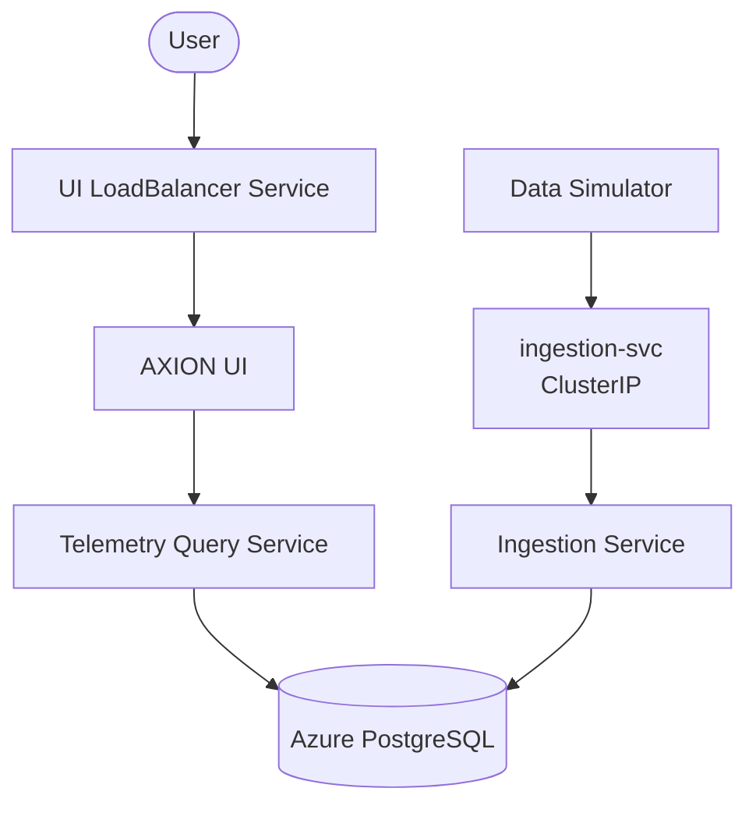
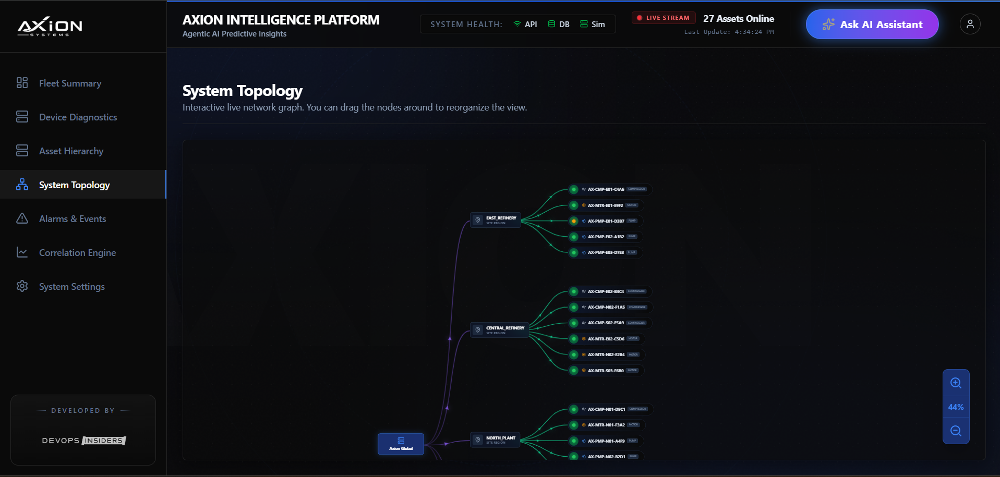

# AXION Kubernetes Deployment

Hands-on Kubernetes deployment project on **Azure Kubernetes Service (AKS)** demonstrating containerized application deployment, Kubernetes networking, service-to-service communication, resource management, and Azure Container Registry integration.

### Tech Stack

`Azure AKS` • `Kubernetes` • `Docker` • `Azure Container Registry` • `Azure Database for PostgreSQL`

---
## Architecture

---
## Request & Data Flow

1. **Data Simulator** generates equipment telemetry data and sends it to the **Ingestion Service** through the internal `ClusterIP` service.
2. **Ingestion Service** processes the incoming telemetry data and stores it in **Azure PostgreSQL**.
3. **Telemetry Query Service** retrieves telemetry data from PostgreSQL and exposes it through backend APIs.
4. **AXION UI** consumes the backend APIs and displays the telemetry data to the user.
5. The UI is externally accessible through a Kubernetes `LoadBalancer` service.

---
## Deployment

Each application component is containerized and deployed independently on Azure Kubernetes Service (AKS).

Detailed build and deployment steps are available inside each component directory:

- [Data Simulator](./axion-data-simulator/)
- [Ingestion Service](./axion-ingestion-service/)
- [Telemetry Query Service](./axion-telemetry-query-service/)
- [AXION UI](./axion-ui/)

---
## Screenshots

### AXION Dashboard

---
## What I Implemented

- Containerized individual application components using Docker.
- Stored container images in Azure Container Registry (ACR).
- Deployed application workloads on Azure Kubernetes Service (AKS).
- Created Kubernetes Deployments and Services for application components.
- Used `ClusterIP` for internal service communication.
- Used `LoadBalancer` service to expose the UI externally.
- Configured resource requests and limits for containers.
- Connected Kubernetes workloads with Azure Database for PostgreSQL.
- Verified pods, deployments, services, and application connectivity using `kubectl`.

---
